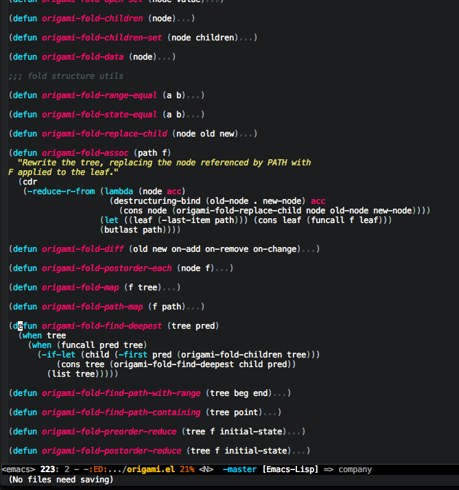

**This is a further development fork from original project [origami](https://github.com/gregsexton/origami.el).
If you are using [melpa](https://melpa.org/#/), please use that version instead of this version!**


[](https://celpa.conao3.com/#/origami)
[](https://github.com/emacs-origami/origami.el/releases/latest)
[](https://www.gnu.org/software/emacs/)
[](https://opensource.org/licenses/MIT)

# What is Origami?
> A text folding minor mode for Emacs.

With this minor mode enabled, you can collapse and expand regions of
text.

The actual buffer contents are never changed in any way. This works by
using overlays to affect how the buffer is presented. This also means
that all of your usual editing commands should work with folded
regions. For example killing and yanking folded text works as you
would expect.

There are many commands provided to make expanding and collapsing text
convenient.

# What does it look like?



# How do I install it?

The easiest way is to just use MELPA. For manual installation:

Firstly, origami requires the following dependencies:

* https://github.com/magnars/dash.el
* https://github.com/magnars/s.el

You should install these anyway, they make working with elisp much
more comfortable.

Drop this package somewhere on your load-path or

```el
(add-to-list 'load-path (expand-file-name "/path/to/origami.el/"))
```

Then

```el
(require 'origami)
```

In a buffer run `M-x origami-mode`, and start experimenting with any
of the supplied origami interactive functions. I recommend binding
these to keys of your choice in the `origami-mode-map`.

There is also `global-origami-mode` if you just want to enable origami
everywhere. For any major-mode that doesn't have explicit support,
origami will use the indentation of the buffer to determine folds.

Origami has been tested on Emacs 24.3, 24.4 and 24.5.

# What can it do?

Origami works by parsing the buffer to determine a fold structure.

The following commands are supplied to move between and manipulate
folds. Those in bold are particularly useful. Many primitives are
provided so that you may compose your own custom functions.

| Commands                                 | Description                                                                                                                 |
|:-----------------------------------------|:----------------------------------------------------------------------------------------------------------------------------|
| origami-open-node                        | Open a fold node.                                                                                                           |
| origami-open-node-recursively            | Open a fold node and all of its children.                                                                                   |
| origami-open-node-recursively-till-depth | Open a fold node and all of its children up to a certain depth.                                                             |
| origami-show-node                        | Like origami-open-node but also opens parent fold nodes recursively so as to ensure the position where point is is visible. |
| origami-close-node                       | Close a fold node.                                                                                                          |
| origami-close-node-recursively           | Close a fold node and all of its children.                                                                                  |
| origami-toggle-node                      | Toggle open or closed a fold node.                                                                                          |
| origami-forward-toggle-node              | Search forward on this line for a node and toggle it open or closed. This makes toggling nodes much more convenient.        |
| **origami-recursively-toggle-node**      | Acts like org-mode header collapsing. Cycle a fold between open, recursively open, closed.                                  |
| origami-open-all-nodes                   | Open every fold in the buffer.                                                                                              |
| origami-close-all-nodes                  | Close every fold in the buffer.                                                                                             |
| origami-toggle-all-nodes                 | Toggle open/closed every fold node in the buffer.                                                                           |
| **origami-show-only-node**               | Close everything but the folds necessary to see the point. Very useful for concentrating on an area of code.                |
| origami-previous-fold                    | Move to the previous fold.                                                                                                  |
| origami-next-fold                        | Move to the end of the next fold.                                                                                           |
| origami-forward-fold                     | Move to the start of the next fold.                                                                                         |
| origami-forward-fold-same-level          | Move to the start of the next fold that is a sibling of the current fold.                                                   |
| origami-backward-fold-same-level         | Move to the start of the previous fold that is a sibling of the current fold.                                               |
| **origami-undo**                         | Undo the last folding operation.                                                                                            |
| origami-redo                             | Redo the last undone folding operation.                                                                                     |
| origami-reset                            | Remove all folds from the buffer and reset all origami state. Useful if origami messes up!                                  |

# Does it support my favourite major-mode?

To some degree, yes. Currently out of the box support is provided for:

* ActionScript
* Batch
* C / C++ / C# / Clojure
* Dart
* Emacs Lisp
* Go
* HTML
* Java / JavaScript / JSX
* Kotlin
* Lisp / Lua
* Markdown
* Objective-C / Org
* PHP / Perl / Python
* Ruby / Rust
* Scala / Shell script / Swift
* TypeScript
* XML

Anything not in this list will be folded using indentation. This works
surprisingly well for most major-modes and is great for folding text.

It should be trivial to add support for any language that uses braces
to delimit blocks. Just add to `origami-parser-alist` something like:
`(mode-name . origami-c-style-parser)`. Adding support for another
lisp dialect should be almost as simple. You can also easily define a
parser for anything with start and end delimiters (similar to braces).
Use the `origami-markers-parser` function for this. There's an example
defined for triple-braces in `origami-parser-alist`.

I'm happy to work on parsers for other languages if interest is
expressed. Cut an issue and I'll see what I can do.

You can write your own parser too. An origami parser is a function
that takes a 'create function' and returns a function taking the
string to be parsed. The returned function should return a list of
fold nodes. Fold nodes are created using the passed-in create
function. Here is an example that creates a single fold node:

```el
(defun my-amazing-parser (create)
  (lambda (content)
    (list (funcall create beginning-of-the-fold-node-point-position ; inclusive
                   end-of-the-fold-node-point-position ; exclusive
                   offset  ; this allows you to show some of the start of the folded text
                   child-nodes))))
```

While I work on writing better documentation for parsing, I suggest
starting by looking at the current parsers in origami-parsers.el to
see how they work.

# Can I override the folding parser for an individual file?

You most certainly can. Just add a buffer-local variable that
references a key in `origami-parser-alist`. Something like:

```el
;; -*- origami-fold-style: triple-braces -*-
```

This will add fold-marker support to that file.

# Autofolding tagged lines when opening a file

1. Enable the mode `origami-auto-global-mode`. This will add a `find-file-hook` that will fold every tagged line.
2. Tag the lines you need to be initialy folded with `*autofold*`.

```java
public void boringMethod(){  // *autofold*
    foo();
    bar();
}
```

3. Sometimes, the tag can not be placed in the same line you need to be folded. In these cases, `*autofold:*` will fold the next line.

```
# A very long shell variable with newlines
 # *autofold:*
LOREM="
  Pellentesque dapibus suscipit ligula.
  Donec posuere augue in quam.
  Etiam vel tortor sodales tellus ultricies commodo.
  Suspendisse potenti.
  Aenean in sem ac leo mollis blandit.
  ...
"
```

4. You can invoke `origami-auto-apply` to reset folding to its initial state, according to tagged lines. Both tags, `*autofold*` and `*autofold:*`, are customizable.


This functionality has been imported from the (now obsoleted) [origami-predef](https://melpa.org/#/origami-predef) package.


# Autofolding some lines when opening a file, based on patterns

The function `origami-auto-apply-patterns` folds the lines containing arbitrary patterns. This allows to define your custom foldings for each major mode.

```el
(defun origami-auto-java()
  "Close some predefined patterns, useful in java."
  (interactive)
  (origami-auto-apply-patterns '("private .*{" "protected .*{")))
(add-hook 'java-mode-hook #'origami-auto-java)

(defun origami-auto-sql()
  "Close some predefined patterns, useful in SQL."
  (interactive)
  (origami-auto-apply-patterns '("create .*table" "create .*view" "begin")))
(add-hook 'sql-mode-hook #'origami-auto-sql)
```

## Comparison and Generic Solution

### How is this different from [yafolding](https://github.com/zenozeng/yafolding.el)?

I wasn't aware of yafolding before writing this. It looks like origami
provides a richer set of functions for manipulating folds. It is also
smarter about folding for the supported modes - yafolding uses
indentation as a folding heuristic.

### How is this different from [hideshow](https://www.emacswiki.org/HideShow)?

Again, origami provides a much richer set of functions for
manipulating folds. I looked at extending hideshow but gave up when I
realised it kept all of its state in the buffer overlays. This makes
it quite difficult to write some of the more complex fold
manipulations.

Origami maintains a data structure representing the folds and provides
a rich library of functions for manipulating it. This makes adding new
folding operations easy.

### How is this different from [folding.el](https://www.emacswiki.org/emacs/folding.el)?

Folding.el uses markers in the buffer to annotate folds. Origami also
supports this and more.

### How is this different from folding implemented by a specific mode?

It's general purpose and concentrates only on providing a great
folding solution. You need only write a parser for origami to get all
of its fold-manipulating features for free.
